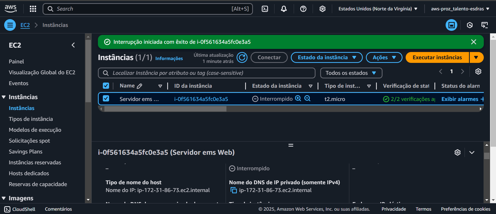
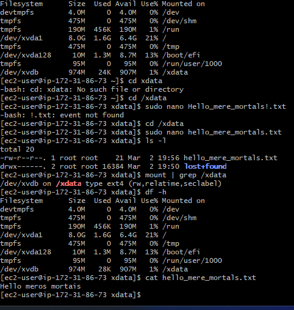

# 🚀 Projeto: Configuração de Instância EC2 com Volume EBS na AWS

## 📝 Descrição do Projeto
Este projeto demonstra como configurar uma instância EC2 no **Amazon Web Services (AWS)**, anexar um volume EBS, e gerenciar o armazenamento na instância, incluindo formatação, montagem e criação de arquivos. 

O objetivo é aprender os conceitos fundamentais de gerenciamento de armazenamento em nuvem e explorar comandos básicos para gerenciar volumes e arquivos em uma instância remota.

---

## 📂 Estrutura do Exercício
1. **Configuração da Instância EC2:**
   - Criar uma instância EC2 com Amazon Linux 2 via Console da AWS.
   **Imagem: Configuração da Instância EC2**
   

2. **Conexão via SSH:**
   - Usar uma chave privada para conectar-se à instância.
   **Imagem: Conexão via SSH**
    

3. **Gerenciamento de Volume EBS:**
   - Criar e anexar um volume EBS à instância.

4. **Formatação e Montagem do Volume:**
   - Preparar o volume para uso formatando-o como `ext4` e montando em um diretório.

5. **Criação e Manipulação de Arquivos:**
   - Criar um arquivo de texto simples e realizar verificações utilizando comandos como `ls`, `df -h`, `mount` e `cat`.

---

## 📦 Etapas Realizadas

### **1. Configuração da Instância EC2**
- Uma nova instância foi criada usando o **Amazon Linux 2**.
- Tipo de instância selecionado com base nos recursos necessários.

---

### **2. Conexão via SSH**
- Utilizado o comando SSH para acessar a instância:
```bash
ssh -i "caminho/para/sua-chave.pem" ec2-user@IP-da-instância


